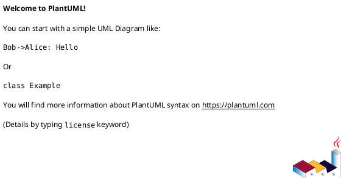

# LiveF1Strategy — System Documentation (v0.1.0)

## Section 1: Project and Goals
**Objective.** Build a real-time, full-stack system to **select and compare race strategies during live F1 events**, combining streaming telemetry (OpenF1) with historical data, tyre models, pit-loss estimation, and undercut/overcut predictors. The application supports the **Ops Room** and race engineers with actionable strategy options, while exposing a simplified viewer for non-technical users.

---

## Section 2: Requirements Analysis

### 2.1 Actors
- **Race Strategist (Primary):** selects and locks plans.
- **Performance Engineer:** tunes model inputs.
- **Ops Room/Team Principal:** views dashboards.
- **Analyst:** runs post-race backtests.
- **External systems:** OpenF1 API, Weather feed, Kafka, Storage.

### 2.2 Use Cases
- **UC-1:** Live strategy recompute (per lap/event).
- **UC-2:** What-If simulation (pit-loss, degradation, probabilities).
- **UC-3:** Undercut/Overcut analyzer.
- **UC-4:** SC/VSC response helper.
- **UC-5:** Post-race backtest.

### 2.3 Domain Assumptions
- OpenF1 latency <2s.
- Tyre degradation ~linear with phase breaks.
- Pit-loss varies with SC/VSC.
- Noise tolerated unless >X laps.

### 2.4 Requirements
**Functional:**
1. Ingestion (REST/WS → Arrow → Kafka).
2. Normalization & storage (Parquet).
3. Real-time strategy engine.
4. What-if service.
5. Undercut/overcut service.
6. API layer (FastAPI + GraphQL).
7. UI (React/Vite).
8. Backtest & reporting.
9. Auth & audit.

**Non-functional:**
- Latency <1s (P95).
- Throughput 10k msgs/min.
- Exactly-once ingestion.
- Observability (metrics, traces).
- JWT + RBAC.
- Portable via Docker/K8s.

---

## Section 3: Design

### 3.1 High-Level Architecture
Components:
- **Ingestion Service** → **Normalizer (Arrow)** → **Kafka**
- **Strategy Engine**, **What-If**, **Undercut/Overcut**
- **Storage:** Parquet + Postgres
- **API Gateway:** FastAPI + GraphQL
- **UI:** React/Vite
- **ML Models:** tyre, pit-loss, success predictors
- **Ops:** Prometheus, Grafana, CI/CD

### 3.2 UML Placeholders
> Replace with your own PlantUML diagrams.

- **Use Case Diagram**

- **Component Diagram**

- **Sequence Diagram (UC-1: Live recompute)**

- **Sequence Diagram (UC-4: SC/VSC response)**

- **Class Diagram**

### 3.3 Design Decisions
- Event-driven with Kafka.
- Arrow → Parquet for unified analytics.
- Heuristic vs ML path separation.
- Human-in-the-loop with audit logs.

---

## Section 4: Data Design

### 4.1 Schemas
- **telemetry.normalized:** timestamp, sessionId, driverCode, lap, s1, s2, s3, lapTime, gaps, compound, stintNo, flags.
- **events.race:** timestamp, type (SC/VSC/Pit), lap, driverCode?, notes.
- **strategy.options:** timestamp, driverCode, options[] {pitLaps[], compounds[], expTotal, variance, pUndercut}.

### 4.2 Parquet Partitioning
`season=YYYY/race=round/session={FP,Q,R}`

### 4.3 Postgres Tables
- users
- locks
- whatif_sessions
- model_priors

---

## Section 5: API

**Queries**
- `liveOptions`
- `whatIf`
- `undercutChance`
- `sessionSummary`

**Mutations**
- `lockOption`
- `setPriors`

---

## Section 6: UI Views
- Race overview (track status, SC banners).
- Driver detail (options, timeline).
- What-If panel (sliders).
- Alerts (SC/VSC, undercut widget).
- Reports (HTML/PDF export).

---

## Section 7: ML & Analytics
- Tyre degradation: piecewise-linear + Bayesian updating.
- Pit-loss: track baseline + SC modifiers.
- Undercut success: logistic model.
- Backtests with frozen info.

---

## Section 8: Testing & CI/CD
- Unit tests, property tests, integration tests.
- Scenario sims (SC, VSC, red flags).
- GitHub Actions: CI matrix, coverage gates.
- Helm deployment with blue/green rollout.

---

## Section 9: Security & Compliance
- JWT + RBAC, signed cookies.
- Input validation.
- Logs scrubbed, reproducibility guaranteed.

---

## Section 10: Glossary
Undercut, Overcut, Pit-loss, Deg, Window, Cliff, Stint, SC/VSC, Confidence band.

---

## Appendix A: Backlog
1. Repo scaffold.
2. Ingestion prototype.
3. Strategy engine MVP.
4. Driver detail UI.
5. What-if sliders.
6. Undercut + SC handler.
7. Backtest reports.

---
